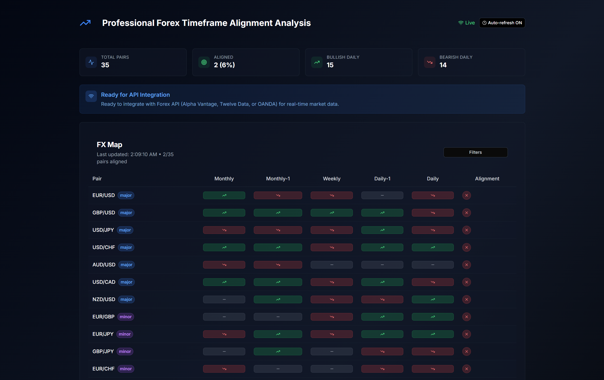

# 📊 Professional Forex Timeframe Alignment Analysis

This is a professional web application designed to help **forex traders** analyze and identify **multi-timeframe alignment** for better trading decisions.  
Built with **Next.js**, **TypeScript**, and **Tailwind CSS**, the project focuses on **performance, scalability, and clean UI/UX**.

---

## ✨ Features

- Real-time visualization of forex timeframe alignment  
- Responsive design for desktop and mobile  
- Smooth and intuitive user experience  
- Clean and modern UI with Tailwind CSS  
- Extensible architecture for adding more data sources and indicators  

---

## 🛠️ Tech Stack

- [Next.js](https://nextjs.org/)  
- [React](https://react.dev/)  
- [TypeScript](https://www.typescriptlang.org/)  
- [Tailwind CSS](https://tailwindcss.com/)  

---

## 📸 Screenshots

> Showcase your app with real previews. Add multiple screenshots or GIFs here.

---

